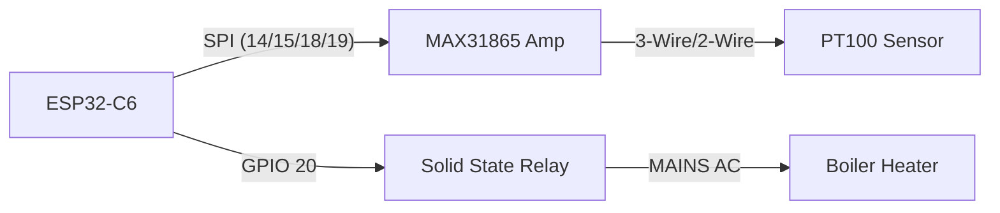

# Rancilio Silvia PID (ESP32-C6)

Professional PID firmware for Rancilio Silvia built on ESP32-C6 (RISC-V). Integrated with Home Assistant via MQTT.

## Features
- **Precise Temperature Control**: PID algorithm with configurable Kp, Ki, Kd.
- **PT100 Sensor Support**: High-precision measurement using MAX31865.
- **SSR Control**: Slow-PWM (1Hz) for Solid State Relay.
- **Connectivity**: 
    - Wi-Fi with Captive Portal for configuration.
    - MQTT Auto-Discovery for Home Assistant.
- **Configuration**: Persistently stored in flash (NVS).

## Wiring Diagram

### Pinout (ESP32-C6)
| Component | Pin Function | ESP32-C6 GPIO |
|-----------|--------------|---------------|
| **MAX31865** | CS           | GPIO 14       |
| **MAX31865** | MOSI         | GPIO 15       |
| **MAX31865** | MISO         | GPIO 18       |
| **MAX31865** | CLK          | GPIO 19       |
| **SSR**      | Control (+)  | GPIO 20       |

### Schematic (Mermaid)


## First Time Setup (WiFi Manager)

1. **Power on** the ESP32.
2. Search for WiFi networks on your phone/laptop.
3. Connect to **`Silvia-PID-Config`**.
4. A captive portal should open (or go to `192.168.4.1`).
5. Select **Configure WiFi**.
6. Enter your Home WiFi credentials.
7. Enter **MQTT Settings**:
   - Server IP
   - Port (default 1883)
   - User/Pass
8. (Optional) Tune **PID Parameters** (Kp, Ki, Kd).
9. Click **Save**. The device will restart and connect to your Home WiFi.

## Development
- Platform: PlatformIO (Core)
- Framework: Arduino (ESP32-C6)
- Flash Size: 4MB

### Build & Upload
```bash
pio run -t upload
```
